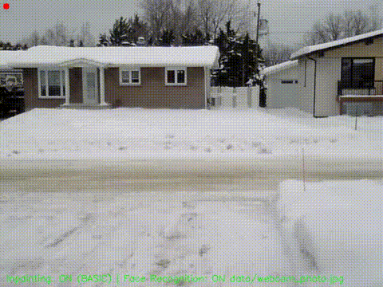

# Real-Time Person Removal & Inpainting System

<p align="center">
  
  
  
  
  
</p>

A real-time video processing system that combines **person segmentation**, **facial recognition**, and **AI-powered inpainting** to seamlessly remove or replace people from live video feeds.

---

## 🎬 Résultats

Voici des démonstrations du système en action :

### Vidéo "Dedans"


### Vidéo "Neige"



### Output Demo


---

## Table of Contents

- [Features](#-features)
- [Architecture](#-architecture)
- [Installation](#-installation)
- [Usage](#-usage)
- [Keyboard Controls](#-keyboard-controls)
- [Configuration](#-configuration)
- [Technical Details](#-technical-details)
- [Project Structure](#-project-structure)
- [License](#-license)

---

##  Features

| Feature | Description |
|---------|-------------|
| **Person Segmentation** | YOLOv11-seg for accurate real-time human detection and segmentation |
|  **Facial Recognition** | Target-specific person removal using face_recognition library |
| **Dual Inpainting Modes** | Choose between fast OpenCV-based or AI-powered LaMa inpainting |
| **Real-Time Processing** | Optimized pipeline for live webcam feeds |
|  **Interactive Controls** | Toggle features on-the-fly with keyboard shortcuts |
| **Video Recording** | Automatic output recording in MP4 format |
|  **Multi-GPU Support** | CUDA, Intel XPU (OpenVINO), Apple MPS, and CPU fallback |

---

##  Architecture

```
┌─────────────────┐    ┌──────────────────┐    ┌─────────────────┐
│   Video Input   │───▶│  YOLOv11-seg     │───▶│  Human Masks    │
│   (Webcam)      │    │  Segmentation    │    │                 │
└─────────────────┘    └──────────────────┘    └────────┬────────┘
                                                        │
┌─────────────────┐    ┌──────────────────┐            │
│  Reference      │───▶│  Face           │◀───────────┘
│  Image          │    │  Recognition     │
└─────────────────┘    └────────┬─────────┘
                                │
                       ┌────────▼─────────┐
                       │  Associate Face  │
                       │  with Body Mask  │
                       └────────┬─────────┘
                                │
              ┌─────────────────┼─────────────────┐
              ▼                 ▼                 ▼
     ┌────────────────┐ ┌────────────────┐ ┌──────────────┐
     │  Basic Mode    │ │   LaMa Mode    │ │   No Match   │
     │  (Background)  │ │  (AI Inpaint)  │ │  (Pass-thru) │
     └────────┬───────┘ └────────┬───────┘ └──────┬───────┘
              │                  │                 │
              └──────────────────┴─────────────────┘
                                │
                       ┌────────▼─────────┐
                       │   Video Output   │
                       │  (Display/Save)  │
                       └──────────────────┘
```

---

## Installation

### Prerequisites

- Python 3.8+
- CUDA-capable GPU (recommended) or Intel GPU with OpenVINO
- Webcam

### Step 1: Clone the Repository

```bash
git clone https://github.com/Glenrunc/MI7_seg_impaint_deepfake.git
cd MI7_seg_impaint_deepfake
```

### Step 2: Create Virtual Environment

```bash
python -m venv venv
source venv/bin/activate  # Linux/macOS
# or
.\venv\Scripts\activate   # Windows
```

### Step 3: Install Dependencies

```bash
# Core dependencies
pip install torch torchvision --index-url https://download.pytorch.org/whl/cu118
pip install ultralytics opencv-python face_recognition numpy omegaconf pyyaml

# LaMa dependencies (from lama folder)
pip install -r lama/requirements.txt
```

### Step 4: Download Models

1. **YOLOv11-seg**: Automatically downloaded on first run, or place in `models/`
2. **LaMa Model**: Download the pre-trained model and place in `models/lama-places/big-lama-regular/`

```bash
# Create model directories
mkdir -p models/lama-places/big-lama-regular/models

# Download LaMa checkpoint (example)
# Place config.yaml and best.ckpt in the appropriate folders
```

---

##  Usage

### Basic Usage

```bash
python main.py
```

### With Custom Reference Image

Edit `main.py` to set your reference image:

```python
image_de_qqn = "data/your_reference_photo.jpg"
```

### With Custom Background

```python
background_image_path = "path/to/background.jpg"
```

---

## ⌨️ Keyboard Controls

| Key | Action |
|-----|--------|
| `I` | Toggle inpainting ON/OFF |
| `L` | Switch to **LaMa** mode (AI-powered, higher quality) |
| `B` | Switch to **Basic** mode (faster, uses background image) |
| `R` | Refresh reference background image |
| `F` | Toggle facial recognition (target-specific vs all persons) |
| `Q` / `ESC` | Quit application |

---

## ⚙️ Configuration

### Inpainting Modes

| Mode | Speed | Quality | Requirements |
|------|-------|---------|--------------|
| **Basic** | ⚡⚡⚡ Fast | Medium | Background reference image |
| **LaMa** | ⚡ Slower | High | GPU recommended, LaMa model |

### FastLaMaInpainter Parameters

```python
lama_model = FastLaMaInpainter(
    model_path="models/lama-places/big-lama-regular",
    checkpoint="best.ckpt",
    max_resolution=512,  # Lower = faster, higher = better quality
    device="cuda"        # "cuda", "xpu", "mps", or "cpu"
)
```

### Face Recognition Tolerance

```python
# In extract_information()
tolerance=0.5  # Lower = stricter matching, Higher = more permissive
```

---

## Technical Details

### Pipeline Components

1. **YOLOv11-seg Segmentation**
   - Detects humans in frame (class 0)
   - Returns pixel-accurate segmentation masks
   - Supports OpenVINO INT8 quantization for Intel GPUs

2. **Face Recognition**
   - Uses `face_recognition` library (based on dlib)
   - Extracts 128-dimensional face encodings
   - Compares against reference person for selective removal

3. **Mask Association**
   - Links detected faces to their corresponding body masks
   - Calculates face centroid from facial landmarks
   - Creates separate face masks (above chin line)

4. **Inpainting Methods**
   - **Basic**: Direct background replacement using captured reference frame
   - **LaMa**: Large Mask Inpainting neural network for context-aware filling

### Performance Optimizations

- cuDNN benchmark mode enabled for CUDA
- TF32 acceleration on supported GPUs
- Resolution limiting for LaMa inference
- Automatic padding to multiples of 8 for FFT operations
- Half-precision (FP16) for YOLO inference

---

## Project Structure

```
MI7_seg_impaint_deepfake/
├── main.py                 # Main application entry point
├── README.md               # This file
├── models/
│   ├── yolo11n-seg.pt      # YOLO segmentation model
│   └── lama-places/        # LaMa inpainting model
│       └── big-lama-regular/
│           ├── config.yaml
│           └── models/
│               └── best.ckpt
├── data/                   # Reference images
├── output/                 # Recorded videos
└── lama/                   # LaMa repository
    ├── saicinpainting/     # LaMa source code
    ├── configs/            # Training configs
    └── requirements.txt
```

---

## Supported Hardware

| Platform | Segmentation | Inpainting | Notes |
|----------|--------------|------------|-------|
| NVIDIA CUDA | ✅ Full | ✅ Full | Recommended |
| Intel XPU (OpenVINO) | ✅ INT8 | ✅ Full | Good performance |
| Apple Silicon (MPS) | ✅ Full | ✅ Full | M1/M2 supported |
| CPU | ✅ Full | ✅ Full | Slower performance |

---

## Future Improvements

- [ ] Multi-person selective removal
- [ ] Temporal consistency for video inpainting
- [ ] GUI interface with parameter tuning
- [ ] Real-time background replacement with depth estimation
- [ ] Export to ONNX/TensorRT for deployment

---

## License

The LaMa inpainting model is licensed under Apache 2.0. See [lama/LICENSE](lama/LICENSE).

---
